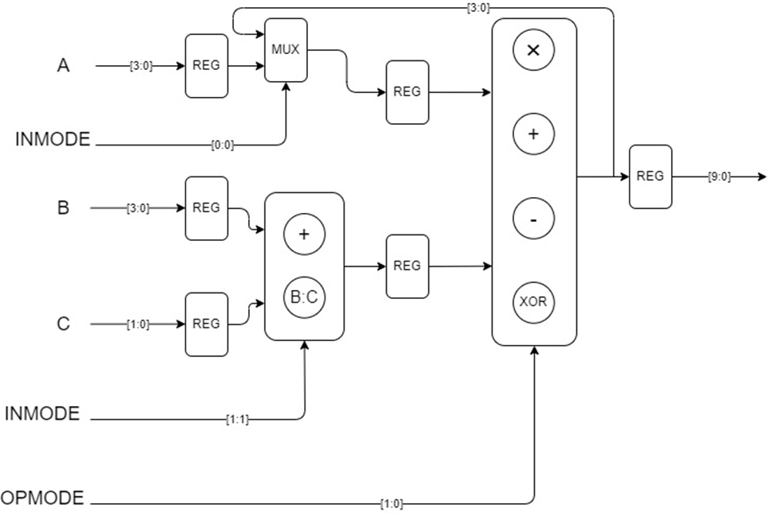

<!---

This file is used to generate your project datasheet. Please fill in the information below and delete any unused
sections.

You can also include images in this folder and reference them in the markdown. Each image must be less than
512 kb in size, and the combined size of all images must be less than 1 MB.
-->

## How it works

The design is a highly configurable ALU chip that can perform multiple arithmetic and logical operations within limited area constraints. The chip will support operations such as multiplication, addition, subtraction, and XOR. It will also support accumulation and iterative multiplication functions by reusing the lower 4 bits of the previous result as a new parameter in the next computation, controlled by input signals.

## How to test

Possible Operations
Using Parameters A, B, and C:
1.	A × (B + C)
2.	A × [B:C] (where [B:C] represents the concatenation of B and C)
3.	A + B + C
4.	A + [B:C]
5.	B + C – A
6.	[B:C] – A
7.	A^(B + C)
8.	A^[B:C]
Using Parameters A, B, and Result:
1.	Result × (B + C)
2.	Result × [B:C]
3.	Result + B + C
4.	Result + [B:C]
5.	B + C – Result
6.	[B:C] – Result
7.	Result^(B + C)
8.	Result^[B:C]

## External hardware

No external hardware required
