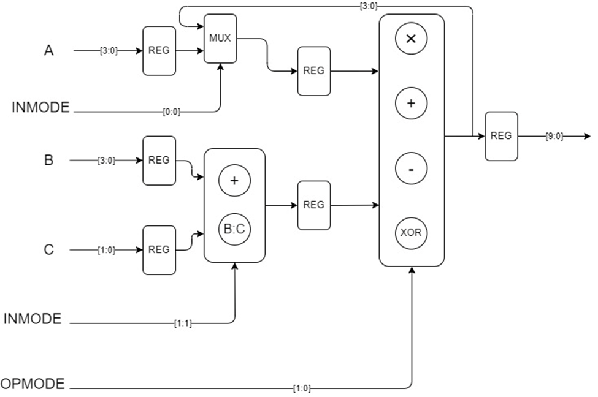
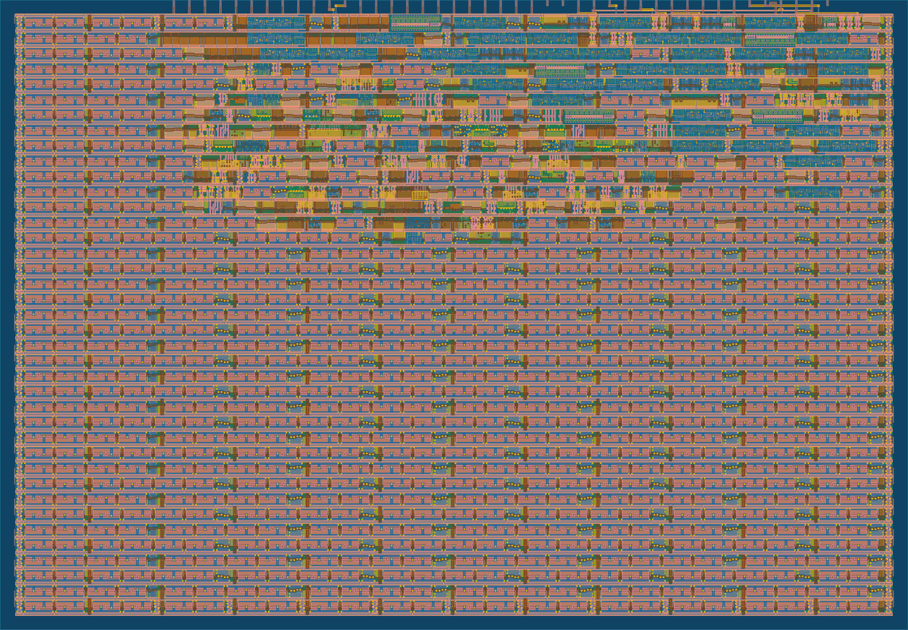

<!---

This file is used to generate your project datasheet. Please fill in the information below and delete any unused
sections.

You can also include images in this folder and reference them in the markdown. Each image must be less than
512 kb in size, and the combined size of all images must be less than 1 MB.
-->

## How it works

The design is a highly configurable ALU chip that can perform multiple arithmetic and logical operations within limited area constraints. The chip will support operations such as multiplication, addition, subtraction, and XOR. It will also support accumulation and iterative multiplication functions by reusing the lower 4 bits of the previous result as a new parameter in the next computation, controlled by input signals.

## How to test

Possible Operations
Using Parameters A, B, and C:
1.	A × (B + C)
2.	A × [B:C] (where [B:C] represents the concatenation of B and C)
3.	A + B + C
4.	A + [B:C]
5.	B + C – A
6.	[B:C] – A
7.	A^(B + C)
8.	A^[B:C]
Using Parameters A, B, and Result:
1.	Result × (B + C)
2.	Result × [B:C]
3.	Result + B + C
4.	Result + [B:C]
5.	B + C – Result
6.	[B:C] – Result
7.	Result^(B + C)
8.	Result^[B:C]

## Resource utilization

### Routing Stats
| Utilisation (%) | Wire length (um) |
|-----------------|------------------|
| 16.84           | 5671             |

### Cell Usage by Category
| Category        | Cells                                                                                                      | Count |
|-----------------|-----------------------------------------------------------------------------------------------------------|-------|
| Fill            | decap fill                                                                                                 | 1334  |
| Tap             | tapvpwrvgnd                                                                                                | 225   |
| Combo Logic     | a22o a21oi a22oi o21ai a21bo a21o or4b a31o o211ai a211o and2b and3b a2bb2o o21bai o211a o31a a2111o o21a a32o o2bb2a o311ai and4b o22a o2111a o221ai o311a or4bb or3b o2bb2ai | 83    |
| Buffer          | buf clkbuf                                                                                                 | 50    |
| Flip Flops      | dfrtp                                                                                                      | 36    |
| NAND            | nand2 nand4 nand3 nand2b                                                                                   | 29    |
| NOR             | nor2 nor3 xnor2                                                                                            | 27    |
| Misc            | conb dlygate4sd3                                                                                           | 25    |
| AND             | and2 and3 and4                                                                                             | 23    |
| OR              | or2 or3 xor2                                                                                               | 8     |
| Multiplexer     | mux2                                                                                                       | 6     |
| Inverter        | inv                                                                                                        | 5     |
| **Total cells** | **292** (excluding fill and tap cells)                                                                     |

## External hardware

No external hardware required
